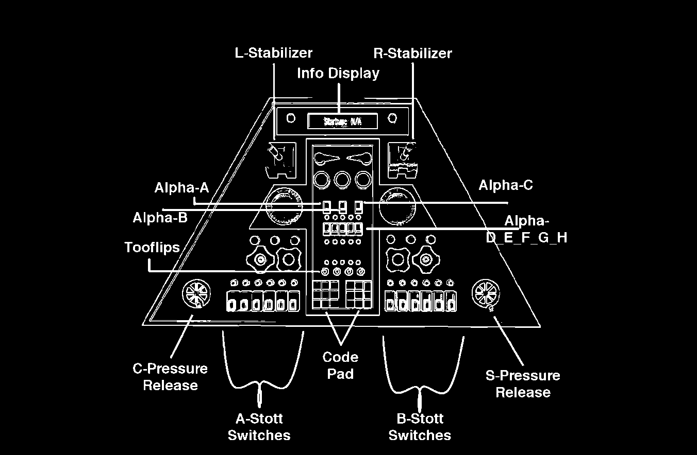
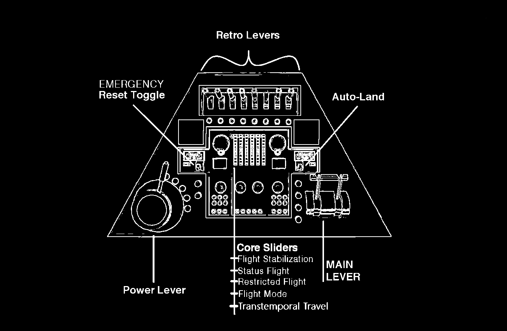

# Basic Operation

***


**Do&#x20;**_**not**_**&#x20;step on the Tardis controls.** It does not like it. It may kill you.


All steps have their respective switches, levers and buttons shown on the images below the procedure.

## Initialization

This sequence shall power up the Tardis. To execute most other sequences, you will need to have powered the Tardis on before.

1. Flick the **Alpha H** switch, followed by the **Alpha C** switch.
2. Flip the **Stott Switch 11.**
3. Pull down the **R-Stabilizer.**
4. Pull the **Power Lever.**

<figure><figcaption>
Alpha H and C, Stott Switch 11, R-Stabilizer
</figcaption></figure> <figure><figcaption>
Power Lever
</figcaption></figure>

### QuickStart

QuickStart allows you to **power the Tardis up faster** by using a shorter sequence, though it will have its **range of capabilities limited** until completely booted up. It is **recommended to not use this approach** unless it is impossible to do otherwise.

1. Flick the **Alpha C** switch.
2. Flip the **Stott Switch 11.**
3. Pull the **Power Lever.**

<figure><figcaption>
Alpha C, Stott Switch 11
</figcaption></figure> <figure><figcaption>
Power Lever
</figcaption></figure>

#### Finalizing the QuickStart

To finalize the QuickStart startup procedure, and completely power the Tardis up, complete the sequence with the steps explained here. This completion will finish as if you had ran the normal Initialization sequence.

1. Flick the **Alpha H** switch.
2. Pull down the **R-Stabilizer.**

<figure><figcaption>
Alpha H, R-Stabilizer
</figcaption></figure>

### Pressure Gauges and Pressure Relief Rotators

On the panel with a colored keypad, there are **two pressure gauges** on the console that display the **built-up pressure in the Tardis’ systems.** These must be cleared periodically. Otherwise, the Tardis could malfunction or even explode.

The gauges are located here:
